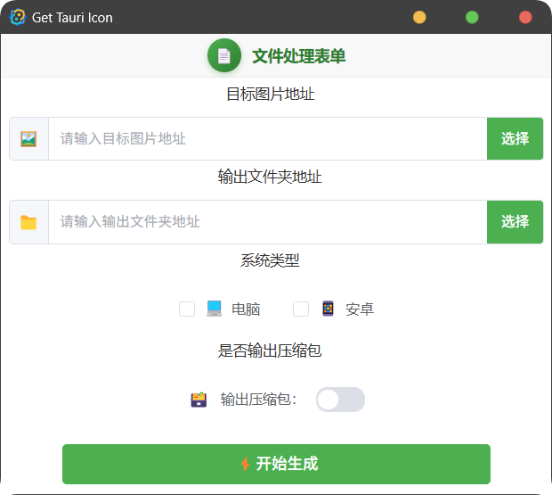

> use Template: [PPX](https://github.com/pangao1990/ppx)
>
> This document was generated using `GPT-4` translation

## How to run or package source code
Initialization and packaging look [here](https://github.com/pangao1990/PPX/blob/main/README.md)

## UI Show

## How to use
1. Pack the Android icon
   - In the first column, select the target image you want to modify (ep: besides normal image files, .svg is also supported).
   - In the second column, select the target folder for output.
   - Select `Android` in the system type.
   - After generating, open the destination folder and find `mipmap-*dpi` * denotes the corresponding dpi
   - Overwrite a series of icons under the `tauri project root directory\src-tauri\gen\android\app\src\main\res` and you are done.
2. Package computer (win, linux, macos) icon series.
   - In the first column, select the target image you want to modify (ep: supports .svg in addition to normal image files).
   - In the second column, select the destination folder for the output.
   - In the second column, select the destination folder for output.
   - Open the destination folder and find the `icons` folder after it is generated.
   - Move and overwrite the `icons` folder under the `tauri project root directory\src-tauri` and you're done.

In addition, it is optional to get the zip file.

## TODO List
- [] Since the author doesn't have a macos system, he can't write a script to output ios image format at the moment, if someone can provide a script, please submit a PR!
- [] Finish `I18n`, since this is a small project for personal use, the addition of `I18n` may increase the size of the file, this can be seen in the community comments